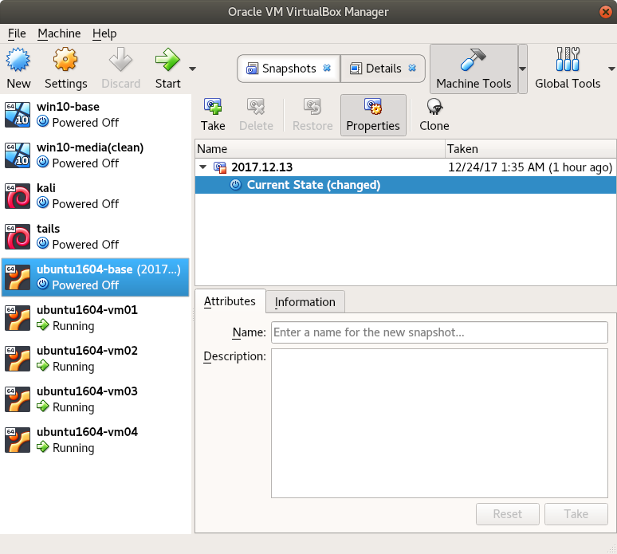

ansible-invadelabs
==================
Example of spinning up Ansible with Virtual Box scripts to create 4 VMs, set hostnames, and test a few commands. Also included is a script to delete the created Virtual Box VMs.

# Install Ansible on host machine
~~~
sudo apt-get install -y ansible
~~~

# Create VirtualBox Host-only Adapter network vboxnet0

# Create base VM image from Ubuntu 16.04
## Create a new VBox with NIC1 on NAT and NIC2 on host-only network vboxnet0

## Configure base VM
Login into new VM, configure admin user, password, and keys. Quick way to copy ssh key to VM:
~~~
ssh-copy-id -i ~/.ssh/id_rsa 192.168.56.100
~~~

Personal preference, set vi for default
~~~
sudo update-alternatives --set editor /usr/bin/vim.basic
~~~

Add password less sudo to /etc/sudoers
~~~
%sudo   ALL=NOPASSWD: ALL
~~~

Install python-minimal for Ansible as it's not included in Ubuntu 16.04
~~~
sudo apt-get install -y python-minimal
~~~

Install vbox guess additions
~~~
$ sudo apt-get install -y dkms
$ curl -O http://download.virtualbox.org/virtualbox/5.2.4/VBoxGuestAdditions_5.2.4.iso
$ sudo mount -o loop VBoxGuestAdditions_5.2.4.iso /mnt
$ cd /mnt
$ sudo ./VBoxLinuxAdditions.run --nox11
$ sudo umount /mnt
$ cd; rm VBoxGuestAdditions_5.2.4.iso
~~~

## Shutdown the VM and take a snapshot
~~~
$ VBoxManage snapshot ubuntu1604-base take 2017.12.13
~~~

# Create linked clone VMs
Create linked clones from VM ubuntu1604-base snapshot 2017.12.13
~~~
./create_linked_clones_vbox.sh
~~~

Example output

# Delete Linked Clone VMs ** DESTRUCTIVE **
When ready to clean up; delete the linked clone VMs permanently
~~~
./delete_linked_clones_vbox.sh
~~~

Example output

# Example Ansible Commands
Ping all hosts
~~~
$ ansible -i hosts all -m ping
~~~

Get the hostname from all VMs in the "vms" group from the hosts file
~~~
$ ansible -i hosts vms -a '/bin/hostname'
~~~

Get python version from all VMs
~~~
$ ansible -i hosts all -a '/usr/bin/python --version'
~~~

Use the shell module to run the shutdown command on all VMs as root (-b)
~~~
$ ansible -i hosts vms -b -a 'shutdown -h now'
~~~

Run the command echo $TERM on all VMs
~~~
$ ansible -i hosts all -m shell -a 'echo $TERM'
~~~

Copy the file motd in the local directoy to all VMs
~~~
$ ansible -i hosts vms -m copy -b -a "src=motd dest=/etc/motd"
~~~

Get facts from all hosts
~~~
$ ansible -i hosts all -m setup
~~~

Increase how many operations occur concurrently
~~~
-f 10
~~~

# Old - added to base image
Ubuntu 16.04 server doesn't come with python, which we need for Ansible.
~~~
ansible-playbook -i hosts install_python.yaml
~~~

Work around to accept new SSH keys. Fixed in script when SSH'ing with '-o StrictHostKeyChecking=no' to set hostname
~~~
$ cat ~/.ansible.cfg
[defaults]
host_key_checking = False
~~~
